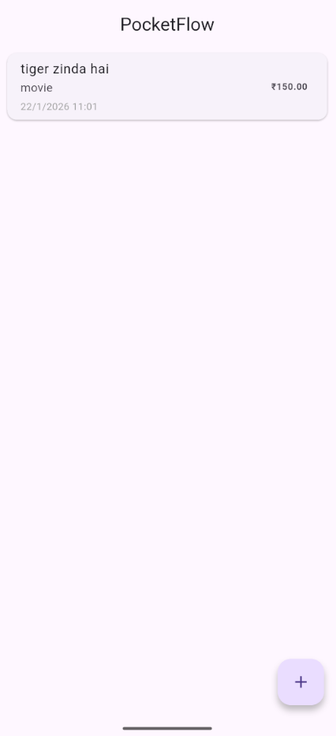
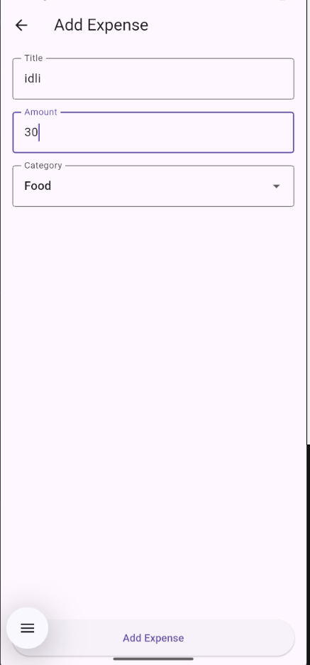
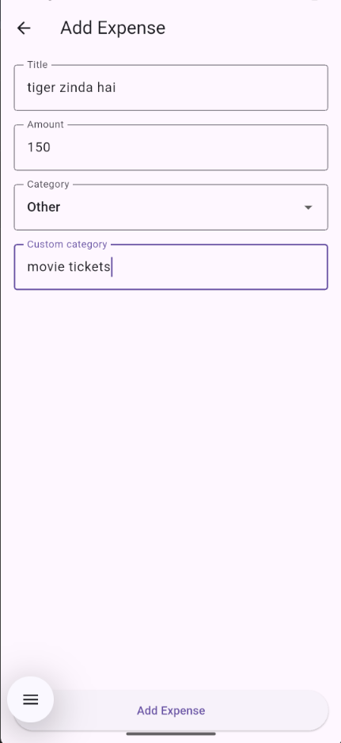

# PocketFlow – Expense Tracker App 💸

PocketFlow is a Flutter-based expense tracking application that allows users to manage daily expenses with custom categories and offline functionality.

## 🚀 Features
- Add expenses with title, amount, and category
- Custom category input when "Other" is selected
- Displays date and time for each expense
- Clean and responsive UI
- Fully offline (no backend required)

## 📸 Screenshots

### Home Screen

### Add Expense

### Custom Category

## 🛠️ Built With
- Flutter
- Dart
- Material UI

## 📱 Screens
- Home Screen (Expense List)
- Add Expense Screen

## 🎯 Purpose
This project was built as a side project to demonstrate Flutter fundamentals such as state management, navigation, conditional UI rendering, and clean app structure.

## 🔮 Future Improvements
- Offline persistence using Hive
- Expense deletion
- Category-wise totals

---

⭐ If you like this project, feel free to star the repository!
